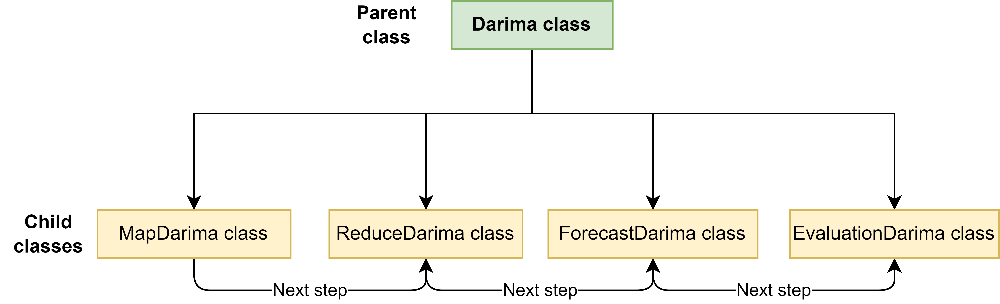

Overview
================

| Authors: **Jonas Hoheise, Kathrin Henkenherm, Ole Katzenberger, Vitali Krilov, Vladislav Stasenko**
| Last doc update: **23.10.2023**
| University: **"Fachhochschule Südwestfalen"**
| Location: **Meschede Germany**
| Module: **Data analysis in Big Data**

This project is an implementation of DARIMA, inspired by the paper available at https://doi.org/10.48550/arXiv.2007.09577.

.. warning::

   - We do not claim any autorship on every part of the Code, since it was inspired by https://github.com/xqnwang/darima.
   - We do not claim any rights on the code, since this was in educational purpose only.

The code is organized into distinct sections: **Darima, PySpark, R Code, and Python Handlers**. The core component is **Darima**, as illustrated in Figure 1.

   *Figure 1*

Before executing the code, you must configure the darima_config.json file by specifying:

- train_datapath: The path to the training dataset.
- test_datapath: The path to the testing dataset.
- num_partitions: The number of chunks or partitions (how many - times should the test dataset be split?).
- data_time_freq: The time frequency of the data (e.g., 4 for Quarterly, 12 for Monthly, 24 for Hourly, 60 for Minutely, 3600 for Secondly).
- method: Choose between "dlsa" or "mean".

.. code-block:: python

   {
  "num_partitions": 4,
  "data_time_freq": 24,
  "train_datapath": "data/NEMASSBOST_train.csv",
  "test_datapath": "data/NEMASSBOST_test.csv",
  "method": "mean"
   }

Within the darima.py file, you'll find several classes. The central class is Darima, and you can trigger it as follows:

.. code-block:: python

   Darima().darima()

The **PySpark** module includes a start_spark() method and a Log4j class. The start_spark method initiates a Spark session, retrieves the Spark logger, and loads configuration files.

The **R Code** section contains the modified R code from https://github.com/xqnwang/darima/blob/master/darima/R/sarima2ar_model.R. This code calculates coefficients and leverages R's auto.arima method to determine optimal parameters for ARIMA.

In the **Python Handlers** module, you'll find converters and utilities. Converters facilitate data object conversions between PySpark, R, and Python. Utilities aid in calculating various values for forecasting and evaluation.

 

